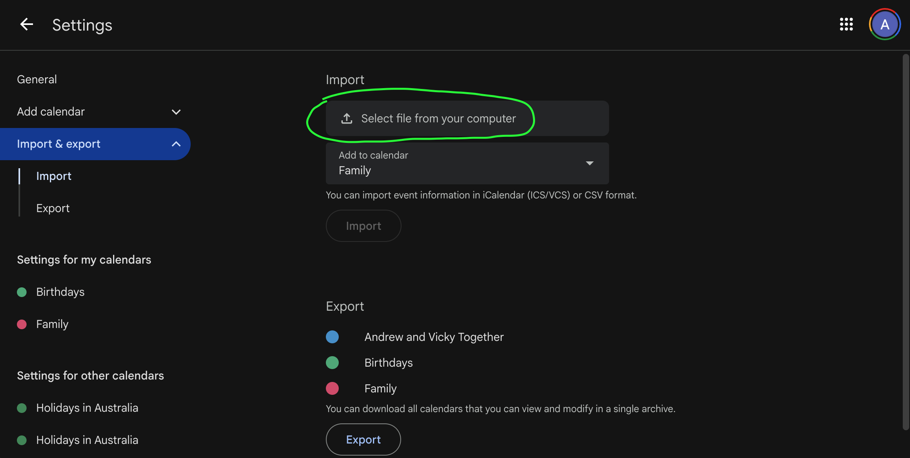

# Mother's Day and Father's Day for Google Calendar

[Download ICS File](https://voltrevo-stuff.s3.ap-southeast-2.amazonaws.com/2025/Australian_Mothers_Fathers_Day.ics)

In Australia, Mother's Day and Father's Day cannot easily be added to Google Calendar.

Google made a change in 2024 to rely on external sources for populating calendars, instead of trying to decide what everyone should get. Makes sense actually.

The external source Google uses for Australia doesn't include Mother's and Father's days, because the Australian Government doesn't actually recognize them officially anywhere.

Maybe that should change, but in the meantime, you can [download this file](https://voltrevo-stuff.s3.ap-southeast-2.amazonaws.com/2025/Australian_Mothers_Fathers_Day.ics) (right click -> save link as) and import it into Google Calendar if you want these days in your calendar.

## How to Import ICS Files

This doesn't seem to be supported on mobile. You'll need your laptop/desktop.

